# TAB2XML EECS 2311 Software Design Project (Winter 2022)
[How to Import project to eclipse via Github](https://github.com/csardana/TAB2XML#How-to-Import-project-to-eclipse-via-Github)  
[Setting up Gradle and Running the Application](https://github.com/csardana/TAB2XML#Setting-up-Gradle-and-Running-the-Application) 
[How create a Personal Access Token](https://github.com/csardana/TAB2XML#How-create-a-Personal-Access-Token)

## How to Import project to eclipse via Github
1. Open eclipse and create a new workspace 

2. After selecting launch, select File -> Import

3. Now choose Git -> Projects from Git (with smart import) and then click next. 
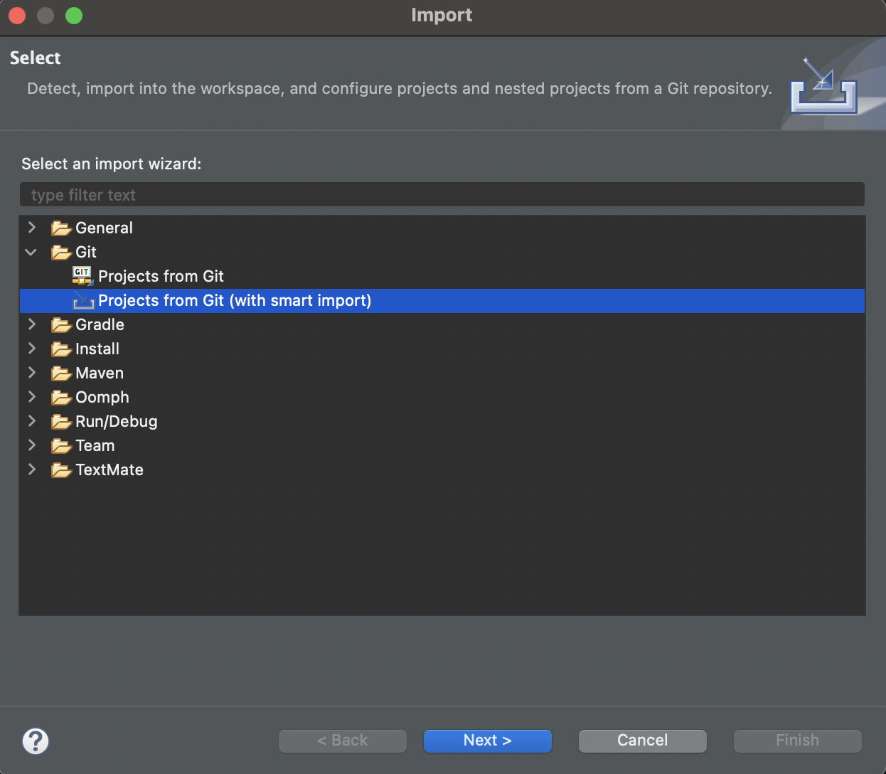

4. Select Clone URI
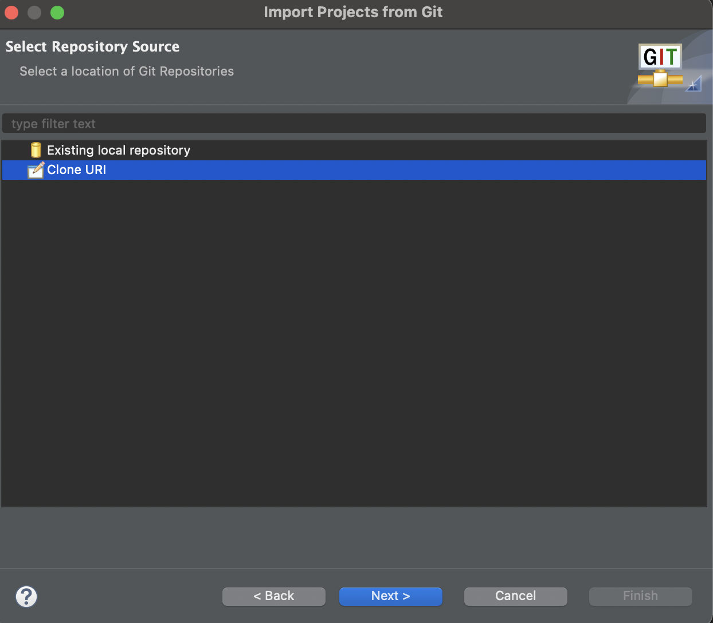

5.Now under the Location box, in the URI textbox copy paste our Github reposirtory which would have all source code: https://github.com/csardana/TAB2XML. For the Autentication box, in the textfield for user: enter your github username and for the password: enter the Personal Access Token.
Now when this is all done, and next is clicked, you will select next again in the next window and then click finish when prompted.  
Note: If you don't have a Personal Access Token, Please look at our section "How to create a Personal Access Token" which will help you procced further in the step of this installation. 
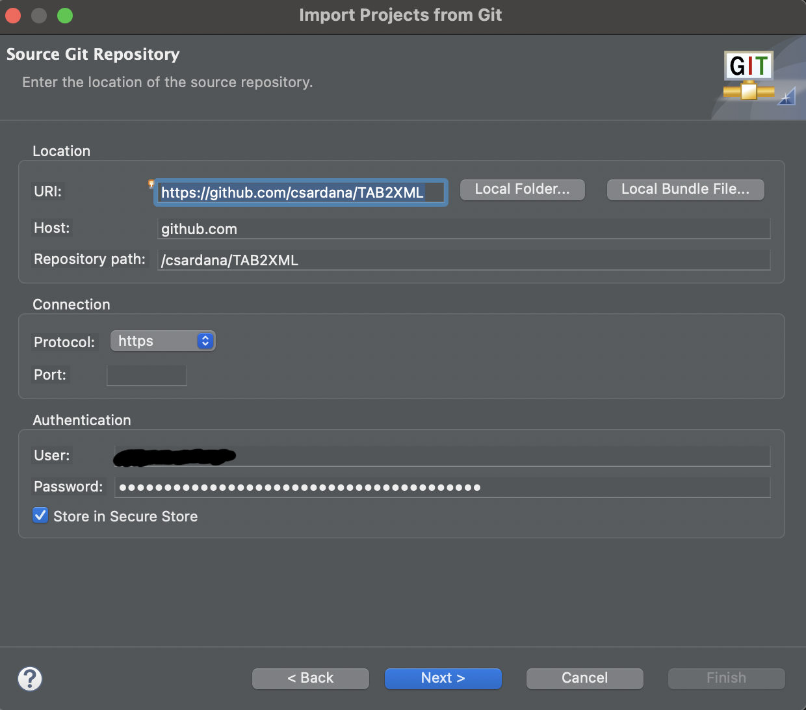

### Setting up Gradle and Running the Application
1. Open Preferences -> Select Gradle -> Specific Gradle version -> Apply and close. 
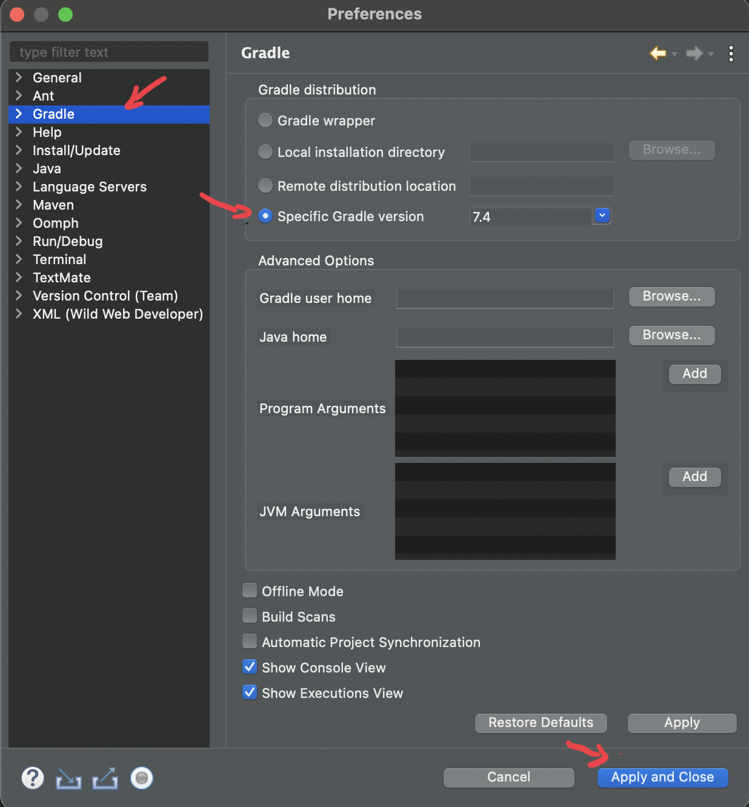

2. To get gradle tasks so the application can run, "Run -> Show View -> Other" 
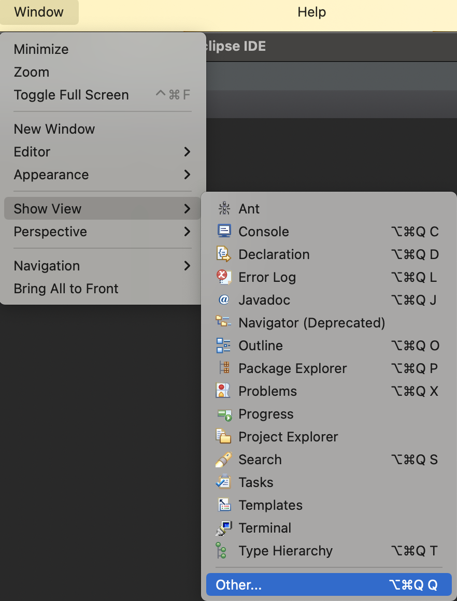

3. Now in the show view select "Gradle -> Gradle Tasks" 
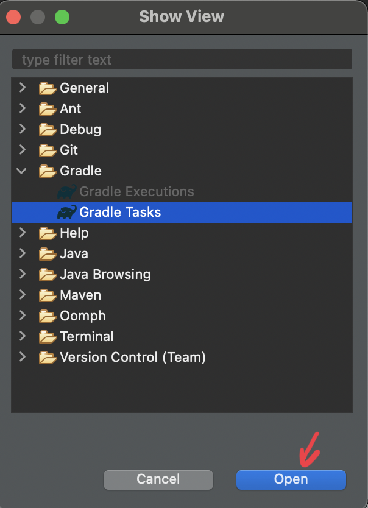

4. After doing these steps, there would be a window named Gradle tasks and underneath that the project name "Project_name -> application -> run"  
Note: Double click "run"
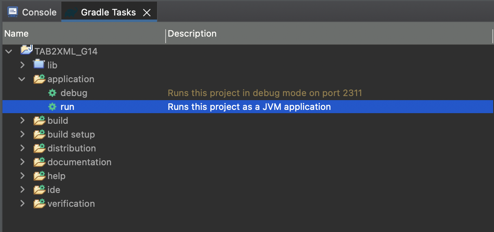

5. Finally the application will open up and the following will open waiting for your input. 
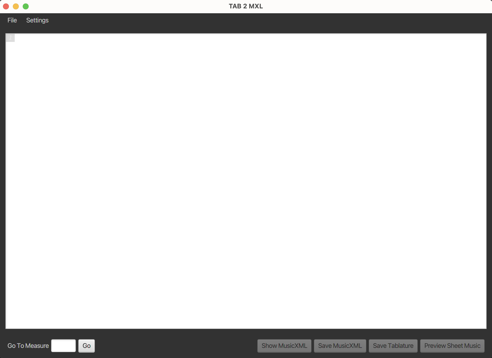

## How create a Personal Access Token
This Personal Access Token will be used when importing our project into eclipse via Github. This portion will take you step by step in creating the Personal Access Token. 
1. Go to your github settings  
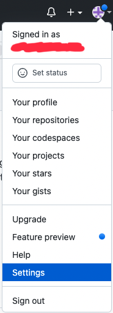

2. Scroll down and select "Developer settings" in the side menu bar. 
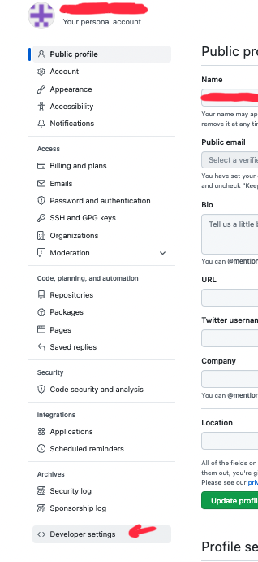

3. Now from these three options select "Personal access tokens" 
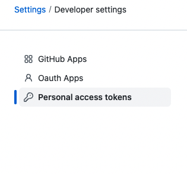

4. To generate a new token, select "Generate new token"  
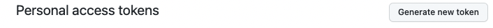

5. Now it will prompt you to enter your password for verification, after doing that, select a date for how long you want this token to work for and make a note for what this token is for. Then scroll all the way at the bottom to click generate.  
Note: When the token is generated, copy and paste it somewhere (e.g notes or notpad) so you can enter when importing a project from github. 
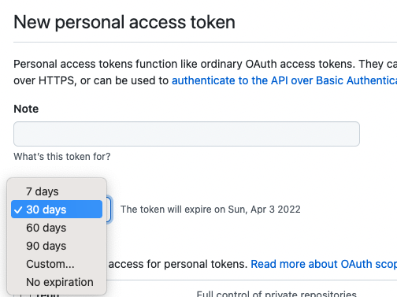
Note: You will see many other options, but we will not select any of those and just select "Generate key" at the bottom of the page!!

   

[![CC BY-SA 4.0][cc-by-sa-shield]][cc-by-sa]

This work is licensed under a
[Creative Commons Attribution-ShareAlike 4.0 International License][cc-by-sa].

[![CC BY-SA 4.0][cc-by-sa-image]][cc-by-sa]

[cc-by-sa]: http://creativecommons.org/licenses/by-sa/4.0/
[cc-by-sa-image]: https://licensebuttons.net/l/by-sa/4.0/88x31.png
[cc-by-sa-shield]: https://img.shields.io/badge/License-CC%20BY--SA%204.0-lightgrey.svg

## Documentation
[User Manual](https://github.com/csardana/TAB2XML/blob/master/User%20Manual.pdf) ||
